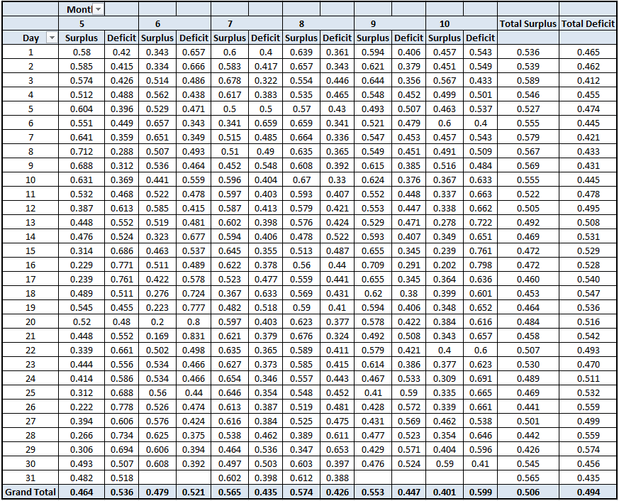
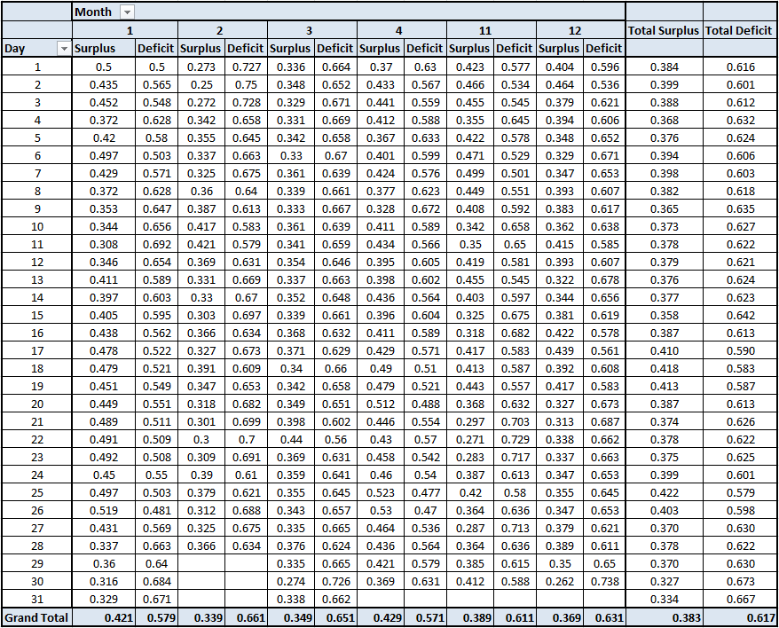
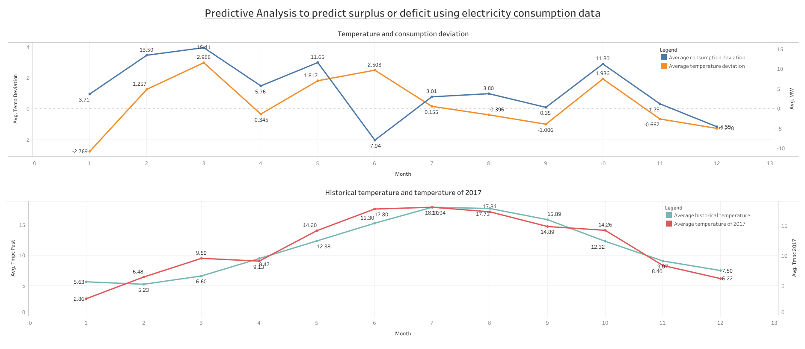

# Predictive-Analysis-using-Electricity-consumption-data

Objective: Predict the probability of getting a surplus or deficit in the electricity consumption of 2017 of France based on the temperature and consumption deviations.

Methodology: Calculate the temperature deviation of 2017 based on the past 10 years historical data and compare it with the consumption deviation provided. Based on the two variables predict the probability of surplus or deficit using Random Forest in Python.

Dataset used:
1. Electricity consumption data
2. Historical temperature data
3. Teperature data of 2017

Results:
The summer and winter temperature deviations have significant effect on the electricity consumption in France. Based on the second graph seen below, we can devivide the months of May, June, July, August, September and October as summer and the rest as winter. Based on the first graph, there is a steep deficit during the month of June and January wich are peak summer and winter respectively. A surplus can be seen on the milder months of May and October.

The tables for summer and winter along with the probabilities of surplus or deficit are shown below:

1. Probability of surplus or deficit during summer months:

2. Probability of surplus or deficit during winter months:

The visulaization from Tableau can be seen below:

